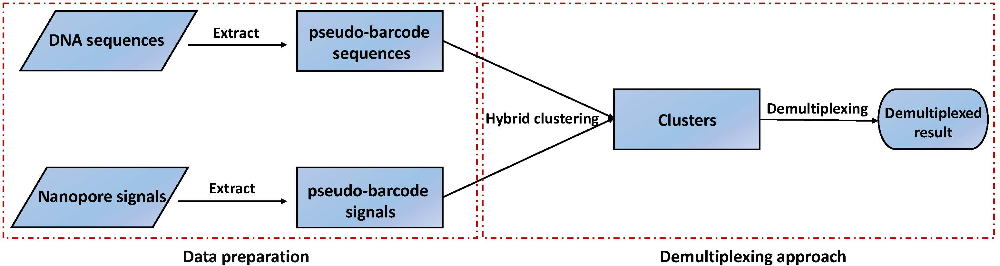

## Overview of HycDemux
This project presents an innovative approach to address the demultiplexing problem of [Oxford Nanopore Tecnology](https://nanoporetech.com/) barcodes by implementing a hybrid clustering algorithm. The algorithm utilizes both the Oxford Nanopore signal and the basecalled DNA sequence, resulting in more accurate demultiplexing outcomes.

The algorithm begins by employing a greedy algorithm to cluster the DNA sequences, yielding preliminary results. Subsequently, the initial results are further refined using nanopore signals. This iterative refinement process enhances the accuracy of the clustering, particularly on datasets that contain a substantial number of barcodes. Based on a voting mechanism, the clustering results are transformed into demultiplexed results.

Moreover, the algorithm incorporates a GPU-based acceleration mechanism, enhancing the overall operational efficiency of the algorithm. This integration of GPU acceleration facilitates faster processing and analysis, leading to improved performance and reduced computational time.

Compared to existing demultiplexing tools such as Guppy, this algorithm demonstrates more stable performance across various datasets, especially those comprising a significant number of barcodes.

For any questions about this project, please contact the developer via the following email: 201911865@mail.sdu.edu.cn.
## Table of contents

  * [Requirements](#requirements)
  * [Installation](#installation)
  * [Using our hybrid clustering algorithm](#using-our-hybrid-clustering-algorithm)
     * [Step 1: Data preparation for clustering](#step-1-Data-preparation-for-clustering)
     * [Step 2: Hybrid clustering](#step-2-Hybrid-clustering)
     * [Step 3: Demultiplexing from clustering results](#step-3-Demultiplexing-from-clustering-results)
  * [All datasets](#All-datasets)
      * [Dataset for test example](#Dataset-for-test-example)
      * [Datasets used to evaluate our algorithm](#Datasets-used-to-evaluate-our-algorithm)
      * [Labels for datasets used to evaluate demultiplexing performance](#Labels-for-datasets-used-to-evaluate-demultiplexing-performance)
  * [Acknowledgments](#acknowledgments)
  * [License](#license)
  * [Cite](#cite)


## Requirements
Our hybrid clustering algorithm runs Linux and requires CUDA 11.7+, conda 4.9.2+ and gcc 9.4.0+.


## Installation

You can create python virtual environment with conda for run our algorithm:
```bash
conda env create -f hybridClustering.yaml
```

and generate executable programs needed by our algorithm:
```bash
bash generateBinaryPrograms.sh
```


## Using our hybrid clustering algorithm
To utilize our tool, users are required to provide the following data:
   * Raw nanopore signals: These are the original     signals obtained from nanopore sequencing.
   * DNA sequences after sequencing: The DNA sequences obtained through the sequencing process.
   * Barcode sequences: The specific sequences corresponding to the barcodes used in the experiment.
   * Adapter sequence: The adapter sequence used in the sequencing process.

### Step 1: Data preparation for clustering

The user employs the `mainDataPreparation.py` script to extract the barcode data. In this step,
the user inputs all the aforementioned data, and the output includes pseudo-barcode signals(the barcode signals
extracted by our method), pseudo-barcode sequences(the barcode sequences extracted by our method), and the
standard barcode signals corresponding to the barcode sequences.

The specific parameters are as follows:
   | Parameters   | Description |
   |  :----:  | :----:  |
   | --h  | show this help message and exit |
   | --sigDir  | Indicates a path to a folder containing only nanopore signal files (format: txt). |
   | --seqFile  | Indicates a fasta file that containing sequenced DNA sequences. |
   | --barSeqFile  | Indicates a fasta file that containing barcode sequences. |
   | --sigRootName  | Indicates the prefix name of the signal file. |
   | --adapSeq  | Indicates a adapter sequence. |
   | --oADir  | Indicates a folder for storing standard nanopore signal corresponding to the adapter sequence. |
   | --oBDir  | Indicates a folder for storing extracted barcode signals from nanopore signals. |
   | --oTBDir  | Indicates a folder for storing strandard barcode signals. |
   | --oBF   | Indicates a fasta file to record the extracted barcode sequences. |
   | --bl  | Indicates the sequence length of the barcode (including flanking sequences). |
   | --spl  | Indicates the length of the prefix sequence. The barcode sequence is in this prefix sequence. |


When the dataset for testing is prepared [Dataset for test example](#Dataset-for-test-example), users can run the following command to test whether this module is deployed successfully:
```bash
bash runExample_mainDataPreparation.sh
```

### Step 2: Hybrid clustering

The user then uses the `mainHybridClustering.py` script for clustering. Here, the user needs to
provide the pseudo-barcode signals and pseudo-barcode sequences as input. The output is a file containing the
clustering results.

The specific parameters are as follows:
   | Parameters   | Description |
   |  :----:  | :----:  |
   | --h  | show this help message and exit |
   | --barSigDir  | Indicates a path to a folder containing only extracted barcode signal files (format: txt). |
   | --barSeqFile  | Indicates a fasta file that containing extracted barcode sequences. |
   | --barSeqFile  | Indicates a fasta file that containing barcode sequences. |
   | --sigRootName  | Indicates the prefix name of the signal file. |
   | --oclusterFile  | Indicates a file for storing final clustering result. |
   | --precise  | When the estimated number of clusters is greater than 100, it is recommended to set it to 1, otherwise, set it to 0. |

When the dataset for testing is prepared [Dataset for test example](#Dataset-for-test-example), users can run the following command to test whether this module algorithm is deployed successfully:
```bash
bash runExample_mainHybridClustering.sh
```

### Step 3: Demultiplexing from clustering results

Finally, the user applies the `mainDemultiplexByClusteringRes.py` script to convert the clus-
tering results into the final demultiplexing output. This step requires the clustering result file, pseudo-barcode
signals, and the standard nanopore signals as input. The output is a file containing the demultiplexing result.

The specific parameters are as follows:
   | Parameters   | Description |
   |  :----:  | :----:  |
   | --h  | show this help message and exit |
   | --barSigDir  | Indicates a path to a folder containing only extracted barcode signal files (format: txt). |
   | --sigRootName  | Indicates the prefix name of the signal file. |
   | --sbarSigDir  | Indicates the folder where standard signals are stored. |
   | --clusterFile  | Indicates the file that storing the clustering result. |
   | --oDemFile  | Indicates the file for storing final demultiplexing result. |

When the dataset for testing is prepared [Dataset for test example](#Dataset-for-test-example), users can run the following command to test whether this module algorithm is deployed successfully:
```bash
bash runExample_mainDemultiplexByClusteringRes.sh
```


## All datasets
We conducted a thorough investigation of the nanopore multi-sample sequencing pipeline(https://github.com/JustLeeee/ONT-sequencing-data-library-preparation-pipeline.git) and successfully generated simulated datasets labeled D1-D7. These datasets are divided into two categories: D1-D3 carry official nanopore barcodes, while D4-D7 feature randomly generated barcodes.

Each dataset, from D1 to D7, consists of a specific number of barcodes: 12, 24, 96, 200, 250, 300, and 350, respectively. In each dataset, every 1000 sequences are associated with a unique barcode. For example, in D1, barcode0 is linked to the first 1000 reads. To simulate the nanopore sequencing process, we utilized Deepsimulator1.5(https://github.com/liyu95/DeepSimulator.git). This software took each sequence in the dataset as input, generating simulated nanopore signals and corresponding base-called sequences.

D4-D6 are all subsets of D7, and D4 (D5, D6) is composed of sequences corresponding to the first 200 (250, 300) barcodes in D7. It is important to note that datasets D4-D7 underwent a filtering process to exclude the electrical signals of certain reads. These filtered reads were short in length, and the simulated data generated from them exhibited low quality. To track these low-quality sequences, we documented their indices in a file named "350ErrorReadsIndex.txt." Consequently, datasets D4-D7 do not include the electrical signals from these problematic reads. As an example, in D4, the signal files associated with all reads connected to barcode1 range from timeSeries_1000.txt to timeSeries_1999.txt. However, the signal file timeSeries_1012.txt is not included due to its association with a filtered read.

To evaluate the performance of our algorithm, we generated new multi-sample sequencing data using Badread model (https://github.com/rrwick/Badread) and applied the ``nanopore2023" error model. These datasets (denote as DB4-DB7) effectively simulate real nanopore data generated by the latest sequencer, MinION R10.4. The code to generate these datasets can be accessed through https://github.com/junhaiqi/MSNANOSIM.git.

All datasets were augmented with an additional 1000 sequences that either lacked or had incomplete barcode regions (with a missing ratio greater than 0.6). These sequences were classified as negative samples and their correct barcode label should be "unclassified". In contrast, sequences containing the complete barcode region were categorized as positive samples. This additional dataset is named the negative sample dataset. 

`Note: The signal folders in D1-D7 and DB4-DB7 do not contain the nanopore signals corresponding to these negative sample sequences, we give them separately. In addition, these negative sample sequences are not included in the sequence files in D1-D7, and we also give them separately. The signal data contained in DB4-DB7 is the same as D4-D7. `

### Dataset for test example
This dataset are available through the following links: https://zenodo.org/records/10477413 or https://pan.baidu.com/s/1Cg3nE2rJ4UgzfMSJovW08g?pwd=xh0k

Use the following command to create a folder `example` and  `tempoutput`, 
```bash
mkdir example && mkdir tempoutput
```
and copy the files in the compressed package to `example` for testing.

### Datasets used to evaluate our algorithm
Dataset D1 is available through the following links:
https://pan.baidu.com/s/1xwoDB-sbH_hhXl4oy-dAQQ?pwd=6la7 

Dataset D2 is available through the following links:
https://pan.baidu.com/s/1v3RCLBWuvILLJvn7JBcfzw?pwd=d7rx 

Dataset D3 is available through the following links:
https://pan.baidu.com/s/1UnfcRcZZsFNsOXtXNDT3jw?pwd=abhx 

Dataset D4 is available through the following links:
https://pan.baidu.com/s/1a1s2_4qhmzftBuiGtwZSbg?pwd=jd0o 

Dataset D5 is available through the following links:
https://pan.baidu.com/s/1mcq4Jw1aYXtkQmRKsS38LQ?pwd=mgs9 

Dataset D6 is available through the following links:
https://pan.baidu.com/s/1r4hA6tzrCsaU9x2zOfOVCQ?pwd=ppqv 

Dataset D7 is available through the following links: https://pan.baidu.com/s/1xyQKXleCzjR9EEiS0YjUmw?pwd=0dzz

Dataset DB4-DB7 is available through the following links: https://pan.baidu.com/s/1JatcKa6_tUk0mBihSDzEIg?pwd=hycl

The dataset corresponding to the negative sample sequences is available through the following links: https://pan.baidu.com/s/1DmmbOsg_SHLo4lXEa1fbvg?pwd=hycl

The dataset corresponding to the negative sample nanopore signals is available through the following links: https://pan.baidu.com/s/15u0M25oyIei8CBIhAdyX3Q?pwd=hycl 


`Note: The signal files in datasets D4-D6 are obtained through D7 and the corresponding labels. `
### Labels for datasets used to evaluate demultiplexing performance
Labels of datasets are available through the following links:
https://pan.baidu.com/s/1W5yHMKvPxO45WZj58NtmPg?pwd=d4ua 


## Acknowledgments
Thanks to Master Li Zhengyi for constructing label tables of datasets.

## License 
GNU General Public License v3.0.

## Cite
Han, R., Qi, J., Xue, Y. et al. HycDemux: a hybrid unsupervised approach for accurate barcoded sample demultiplexing in nanopore sequencing. Genome Biol 24, 222 (2023). https://doi.org/10.1186/s13059-023-03053-1.
